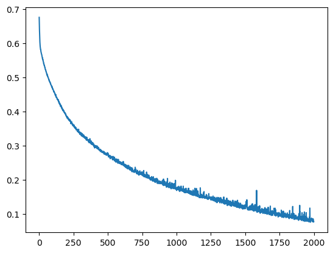
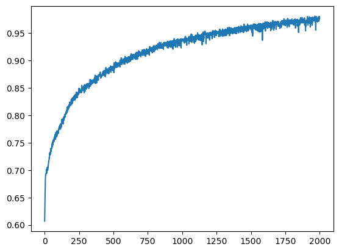

## Import needed headers


```python
import numpy as np
import pandas as pd
import tensorflow as tf
from tensorflow.keras import layers
from keras.layers import Dense, Dropout, Activation
from keras.optimizers import SGD
from matplotlib import pyplot as plt
from sklearn.model_selection import train_test_split
```

## Read the files and have a look of what's inside


```python
df = pd.read_csv('./water_potability.csv', encoding='utf-8', low_memory = True)
df
```


<div>
<style scoped>
    .dataframe tbody tr th:only-of-type {
        vertical-align: middle;
    }

    .dataframe tbody tr th {
        vertical-align: top;
    }

    .dataframe thead th {
        text-align: right;
    }
</style>
<table border="1" class="dataframe">
  <thead>
    <tr style="text-align: right;">
      <th></th>
      <th>ph</th>
      <th>Hardness</th>
      <th>Solids</th>
      <th>Chloramines</th>
      <th>Sulfate</th>
      <th>Conductivity</th>
      <th>Organic_carbon</th>
      <th>Trihalomethanes</th>
      <th>Turbidity</th>
      <th>Potability</th>
    </tr>
  </thead>
  <tbody>
    <tr>
      <th>0</th>
      <td>NaN</td>
      <td>204.890455</td>
      <td>20791.318981</td>
      <td>7.300212</td>
      <td>368.516441</td>
      <td>564.308654</td>
      <td>10.379783</td>
      <td>86.990970</td>
      <td>2.963135</td>
      <td>0</td>
    </tr>
    <tr>
      <th>1</th>
      <td>3.716080</td>
      <td>129.422921</td>
      <td>18630.057858</td>
      <td>6.635246</td>
      <td>NaN</td>
      <td>592.885359</td>
      <td>15.180013</td>
      <td>56.329076</td>
      <td>4.500656</td>
      <td>0</td>
    </tr>
    <tr>
      <th>2</th>
      <td>8.099124</td>
      <td>224.236259</td>
      <td>19909.541732</td>
      <td>9.275884</td>
      <td>NaN</td>
      <td>418.606213</td>
      <td>16.868637</td>
      <td>66.420093</td>
      <td>3.055934</td>
      <td>0</td>
    </tr>
    <tr>
      <th>3</th>
      <td>8.316766</td>
      <td>214.373394</td>
      <td>22018.417441</td>
      <td>8.059332</td>
      <td>356.886136</td>
      <td>363.266516</td>
      <td>18.436524</td>
      <td>100.341674</td>
      <td>4.628771</td>
      <td>0</td>
    </tr>
    <tr>
      <th>4</th>
      <td>9.092223</td>
      <td>181.101509</td>
      <td>17978.986339</td>
      <td>6.546600</td>
      <td>310.135738</td>
      <td>398.410813</td>
      <td>11.558279</td>
      <td>31.997993</td>
      <td>4.075075</td>
      <td>0</td>
    </tr>
    <tr>
      <th>...</th>
      <td>...</td>
      <td>...</td>
      <td>...</td>
      <td>...</td>
      <td>...</td>
      <td>...</td>
      <td>...</td>
      <td>...</td>
      <td>...</td>
      <td>...</td>
    </tr>
    <tr>
      <th>3271</th>
      <td>4.668102</td>
      <td>193.681735</td>
      <td>47580.991603</td>
      <td>7.166639</td>
      <td>359.948574</td>
      <td>526.424171</td>
      <td>13.894419</td>
      <td>66.687695</td>
      <td>4.435821</td>
      <td>1</td>
    </tr>
    <tr>
      <th>3272</th>
      <td>7.808856</td>
      <td>193.553212</td>
      <td>17329.802160</td>
      <td>8.061362</td>
      <td>NaN</td>
      <td>392.449580</td>
      <td>19.903225</td>
      <td>NaN</td>
      <td>2.798243</td>
      <td>1</td>
    </tr>
    <tr>
      <th>3273</th>
      <td>9.419510</td>
      <td>175.762646</td>
      <td>33155.578218</td>
      <td>7.350233</td>
      <td>NaN</td>
      <td>432.044783</td>
      <td>11.039070</td>
      <td>69.845400</td>
      <td>3.298875</td>
      <td>1</td>
    </tr>
    <tr>
      <th>3274</th>
      <td>5.126763</td>
      <td>230.603758</td>
      <td>11983.869376</td>
      <td>6.303357</td>
      <td>NaN</td>
      <td>402.883113</td>
      <td>11.168946</td>
      <td>77.488213</td>
      <td>4.708658</td>
      <td>1</td>
    </tr>
    <tr>
      <th>3275</th>
      <td>7.874671</td>
      <td>195.102299</td>
      <td>17404.177061</td>
      <td>7.509306</td>
      <td>NaN</td>
      <td>327.459760</td>
      <td>16.140368</td>
      <td>78.698446</td>
      <td>2.309149</td>
      <td>1</td>
    </tr>
  </tbody>
</table>
<p>3276 rows × 10 columns</p>
</div>


## Making sure that there're no problems with Target Variable


```python
df.Potability.unique()
```


    array([0, 1], dtype=int64)


## Looking at he percetable of yes/no


```python
df.Potability.value_counts()
```


    0    1998
    1    1278
    Name: Potability, dtype: int64


### The ratio of unpotable water is 1998/total(=3276) = 60.62%

## Purge any unfilled cell by setting them to the average


```python
df['ph'].fillna(float(df['ph'].mean()), inplace=True)
df['Sulfate'].fillna(float(df['Sulfate'].mean()), inplace=True)
df['Trihalomethanes'].fillna(float(df['Trihalomethanes'].mean()), inplace=True)

df.isnull().values.any()
```


    False


## Datas that will be used for the prediction


```python
X = df.iloc[:, 0:-1]
```


```python
y = pd.get_dummies(df["Potability"])
```


<div>
<style scoped>
    .dataframe tbody tr th:only-of-type {
        vertical-align: middle;
    }

    .dataframe tbody tr th {
        vertical-align: top;
    }

    .dataframe thead th {
        text-align: right;
    }
</style>
<table border="1" class="dataframe">
  <thead>
    <tr style="text-align: right;">
      <th></th>
      <th>0</th>
      <th>1</th>
    </tr>
  </thead>
  <tbody>
    <tr>
      <th>0</th>
      <td>1</td>
      <td>0</td>
    </tr>
    <tr>
      <th>1</th>
      <td>1</td>
      <td>0</td>
    </tr>
    <tr>
      <th>2</th>
      <td>1</td>
      <td>0</td>
    </tr>
    <tr>
      <th>3</th>
      <td>1</td>
      <td>0</td>
    </tr>
    <tr>
      <th>4</th>
      <td>1</td>
      <td>0</td>
    </tr>
    <tr>
      <th>...</th>
      <td>...</td>
      <td>...</td>
    </tr>
    <tr>
      <th>3271</th>
      <td>0</td>
      <td>1</td>
    </tr>
    <tr>
      <th>3272</th>
      <td>0</td>
      <td>1</td>
    </tr>
    <tr>
      <th>3273</th>
      <td>0</td>
      <td>1</td>
    </tr>
    <tr>
      <th>3274</th>
      <td>0</td>
      <td>1</td>
    </tr>
    <tr>
      <th>3275</th>
      <td>0</td>
      <td>1</td>
    </tr>
  </tbody>
</table>
<p>3276 rows × 2 columns</p>
</div>


## Normalized the X


```python
from sklearn.preprocessing import StandardScaler
scaler = StandardScaler().fit(X)
X = scaler.transform(X)

```

## Split the datas into 2 groups, one is the training dataset, another is the testing dataset.


```python

X_train, X_test, y_train, y_test = train_test_split(X,y, test_size=0.1,random_state=514,stratify=y)


```


```python
X_train
```


    array([[-3.92695036e-01, -1.00724321e+00, -8.00013553e-01, ...,
             9.81265350e-01, -1.81581241e+00,  1.27700261e+00],
           [-1.02733269e-14, -6.52530481e-01,  7.95769408e-01, ...,
            -1.28995612e+00, -8.27605306e-01, -3.81575471e-01],
           [ 1.34856447e+00,  1.52883949e+00,  6.78188207e-01, ...,
             2.07309357e+00, -1.41093905e+00, -3.02995559e-01],
           ...,
           [-3.35290617e-01,  1.47753928e+00,  2.14991671e-01, ...,
            -1.52202681e+00, -1.20549131e+00,  3.19979549e-01],
           [-5.87328252e-01, -2.13758975e-01, -7.82292884e-01, ...,
            -7.01419907e-01,  9.50720420e-01, -6.11055473e-01],
           [ 1.56437537e-01, -3.20986713e-01, -2.77454546e-03, ...,
             2.00395839e-01,  1.48266403e+00, -4.97216558e-01]])


```python
y_train
```


<div>
<style scoped>
    .dataframe tbody tr th:only-of-type {
        vertical-align: middle;
    }

    .dataframe tbody tr th {
        vertical-align: top;
    }

    .dataframe thead th {
        text-align: right;
    }
</style>
<table border="1" class="dataframe">
  <thead>
    <tr style="text-align: right;">
      <th></th>
      <th>0</th>
      <th>1</th>
    </tr>
  </thead>
  <tbody>
    <tr>
      <th>535</th>
      <td>1</td>
      <td>0</td>
    </tr>
    <tr>
      <th>2054</th>
      <td>1</td>
      <td>0</td>
    </tr>
    <tr>
      <th>2722</th>
      <td>0</td>
      <td>1</td>
    </tr>
    <tr>
      <th>3060</th>
      <td>1</td>
      <td>0</td>
    </tr>
    <tr>
      <th>593</th>
      <td>1</td>
      <td>0</td>
    </tr>
    <tr>
      <th>...</th>
      <td>...</td>
      <td>...</td>
    </tr>
    <tr>
      <th>780</th>
      <td>0</td>
      <td>1</td>
    </tr>
    <tr>
      <th>826</th>
      <td>1</td>
      <td>0</td>
    </tr>
    <tr>
      <th>2902</th>
      <td>1</td>
      <td>0</td>
    </tr>
    <tr>
      <th>2287</th>
      <td>1</td>
      <td>0</td>
    </tr>
    <tr>
      <th>1152</th>
      <td>0</td>
      <td>1</td>
    </tr>
  </tbody>
</table>
<p>2948 rows × 2 columns</p>
</div>


```python
X_test
```


    array([[-1.75912175e+00,  1.15050087e+00, -9.04876070e-01, ...,
             9.27718409e-01, -4.68809634e-01,  1.27663754e+00],
           [-1.02733269e-14, -1.03744713e+00,  7.72929795e-01, ...,
            -2.26382136e-02,  2.07530439e+00,  6.53888308e-01],
           [-7.02946725e-01, -5.75676957e-01,  7.55056276e-01, ...,
             3.71852138e-01, -2.27303257e+00, -1.76468415e+00],
           ...,
           [-2.11575789e-01, -5.83920554e-01,  1.43510617e+00, ...,
             9.01878078e-01, -9.68883823e-02, -3.98579048e-01],
           [ 8.36366664e-01,  4.96696824e-01,  2.15827070e+00, ...,
            -3.96988342e-01,  2.59328638e-01,  1.03682790e+00],
           [-6.73192153e-01, -1.29231238e-01, -5.39980019e-01, ...,
            -4.67143889e-01,  1.18159324e+00,  1.42097348e+00]])


```python
y_test
```


<div>
<style scoped>
    .dataframe tbody tr th:only-of-type {
        vertical-align: middle;
    }

    .dataframe tbody tr th {
        vertical-align: top;
    }

    .dataframe thead th {
        text-align: right;
    }
</style>
<table border="1" class="dataframe">
  <thead>
    <tr style="text-align: right;">
      <th></th>
      <th>0</th>
      <th>1</th>
    </tr>
  </thead>
  <tbody>
    <tr>
      <th>3066</th>
      <td>1</td>
      <td>0</td>
    </tr>
    <tr>
      <th>1862</th>
      <td>1</td>
      <td>0</td>
    </tr>
    <tr>
      <th>1785</th>
      <td>1</td>
      <td>0</td>
    </tr>
    <tr>
      <th>2004</th>
      <td>0</td>
      <td>1</td>
    </tr>
    <tr>
      <th>872</th>
      <td>1</td>
      <td>0</td>
    </tr>
    <tr>
      <th>...</th>
      <td>...</td>
      <td>...</td>
    </tr>
    <tr>
      <th>3135</th>
      <td>0</td>
      <td>1</td>
    </tr>
    <tr>
      <th>2649</th>
      <td>1</td>
      <td>0</td>
    </tr>
    <tr>
      <th>772</th>
      <td>0</td>
      <td>1</td>
    </tr>
    <tr>
      <th>1035</th>
      <td>1</td>
      <td>0</td>
    </tr>
    <tr>
      <th>2571</th>
      <td>1</td>
      <td>0</td>
    </tr>
  </tbody>
</table>
<p>328 rows × 2 columns</p>
</div>


## modeling here


```python

model = tf.keras.Sequential()
model.add(Dense(32, activation='relu', input_dim=X_train.shape[1]))
model.add(Dense(32, activation='relu'))
model.add(Dense(y_train.shape[1], activation='sigmoid'))

```


```python
model.summary()
```

    Model: "sequential"
    _________________________________________________________________
     Layer (type)                Output Shape              Param #   
    =================================================================
     dense (Dense)               (None, 32)                320       
                                                                     
     dense_1 (Dense)             (None, 32)                1056      
                                                                     
     dense_2 (Dense)             (None, 2)                 66        
                                                                     
    =================================================================
    Total params: 1,442
    Trainable params: 1,442
    Non-trainable params: 0
    _________________________________________________________________
    


```python

model.compile(
    loss='binary_crossentropy',
    optimizer='adam',
    metrics=['accuracy']
)

```


```python
epoch_length = 2000

history = model.fit(X_train,
                    y_train,
                    batch_size=32,
                    epochs=epoch_length,
                    verbose=0,
                    use_multiprocessing=True,
                    validation_data=(X_test, y_test))
```


```python
model.save('water_potability.h5')
```


```python
prediction = model.predict(X_test)
prediction = pd.DataFrame(prediction).idxmax(axis=1)
prediction.value_counts()
```

    11/11 [==============================] - 0s 1ms/step
    


    0    198
    1    130
    dtype: int64


### Verification of the ratio of unpotable water is 198/total(=328) = 60.37%, which is close enough to the 60.62% in population

## Show the loss and accuracy change throughout the epochs

```python
history.history.get('loss')
plt.plot(range(epoch_length),history.history.get('loss'))

```


    [<matplotlib.lines.Line2D at 0x17ba7d92e20>]


    

    


```python
plt.plot(range(epoch_length),history.history.get('accuracy'))

```


    [<matplotlib.lines.Line2D at 0x17ba7df1070>]


    

    


```python
best_score = max(history.history['accuracy'])

print(best_score)
```

    0.980664849281311
    

## We archieve the best sccre of 98.07% accuracy with 2000 epoches


```python

```
